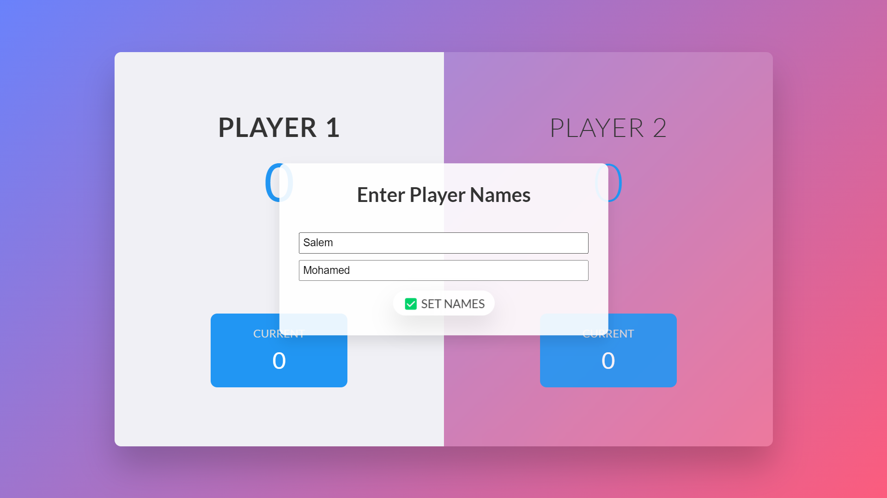

# Roll Dice Game

Welcome to the Roll Dice Game! 🎲 This is a simple web-based game where two players roll dice to reach 100 points first. Be careful, as rolling a 1 will reset your current score!

## Table of Contents

- [Features](#features)
- [Screens](#screens)
- [How to Play](#how-to-play)
- [Technologies Used](#technologies-used)
- [Getting Started](#getting-started)

## Features

- Enter player names.
- Roll a dice to accumulate points.
- Hold your score to save your current points.
- Simple user interface with animations.
- Mobile responsive design.

## Screens

The game consists of the following screens:

1. **Name Input Screen**: 
   - Players can enter their names before starting the game.
   - Displays a text input for both players and a button to set the names.
    

2. **Welcome Screen**: 
   - A brief introduction to the game rules.
   - Includes a button to start the game.
    

3. **Game Screen**: 
   - The main gameplay area where players can roll the dice and see their scores.
   - Shows each player's current score and the results of the last dice roll.
   - Provides buttons to roll the dice or hold the score.
    

4. **Victory Screen**: 
   - Displays when a player reaches 100 points.
   - Shows the winner's name and offers a button to start a new game.
    

5. **Name Change Confirmation Screen**: 
   - Appears after a game ends to confirm whether players want to keep their names or change them for the next game.
   - Provides buttons to keep or change the names.
    

## How to Play

- Enter the names of the two players.
- Click on the Set Names button to proceed.
- Click the Start Game button to begin.
- Roll the dice by clicking the Roll Dice button.
- Accumulate points until one player reaches 100 points.
- If you roll a 1, your current score resets, and the turn switches to the other player.
- You can hold your current points by clicking the Hold button.

## Technologies Used

- HTML
- CSS
- JavaScript
- Google Fonts

## Getting Started

To get a local copy up and running, follow these simple steps:

1. Clone the repository:
   ```bash
   git clone https://github.com/MoSalem149v2/roll-dice-game_DEBI-Task.git
